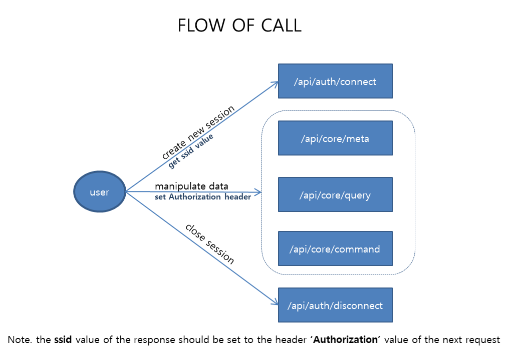

# AgensGraph RESTFul API
- Author: Jungkeun Yoo
## INTRODUCTION
AgensGraph already has RESTFul APIs. 
User can use these APIs to access AgensGraph.  

This contains descriptions of there APIs.

## REQUIREMENT
* AgensGraph as a Graph Database Server
* AgensBrowser as a RESTFul API Server
* Tools for calling these APIs(Restlet Client as Chrome plugin)

## SETUP
You can download below link
- DOWNLOAD [agens graph](https://bitnine.net/downloads/agensgraph-v-1-3-linux/)
- DOWNLOAD [agens browser](https://bitnine.net/downloads/agensbrowser-v-1-0/)

you can also refer to documentation in [bitnine site](https://bitnine.net/documentation/) for installation.

## FLOW



### /api/auth/connect
1st call must be '/api/auth/connect'

#### request
```
URL: http://localhost:8085/api/auth/connect
Method: GET
Parameter: NO
```
#### response
```
{
"valid": true,
"user_ip": "0:0:0:0:0:0:0:1",
"user_name": "agens",
"state": "SUCCESS",
"message": "AgensBrowser web v1.0 (since 2018-02-01)",
"ssid": "df3f72e5-33f3-46b0-9cb6-c72be56f89e3",
"timestamp": "2018-08-20 04:42:27"
}
```
the important thing is to remember the ssid value in the response.
At the next request, this value will be set request header 'Authorization'.

### /api/core/meta
This call retrieves the metadata of the specific object in graph db(node, edge...)

#### request
```
URL: http://localhost:8085/api/core/meta
Method: GET
Parameter: from
```
#### response
```
{
    "meta": {
        "nodes": [
            {
                "data": {
                    "size": 19,
                    "name": "hw",
                    "id": "12",
                    "labels": [
                        "NODE"
                    ],
                    "props": {
                        "owner": "hazard11",
                        "size": 19,
                        "name": "hw",
                        "is_dirty": false,
                        "id": "12",
                        "size_not_empty": 19,
                        "desc": ""
                    }
                }
            }
        ],
        "meta": [
            {
                "owner": "",
                "size": 1,
                "neighbors": [
                ],
                "name": "EDGE",
                "is_dirty": true,
                "oid": "118a8eb2-30af-4095-8a9b-153eabf88182",
                "type": "EDGE",
                "size_not_empty": 1,
                "properties": [
                ],
                "desc": ""
            },
            {
                "owner": "",
                "size": 1,
                "neighbors": [
                ],
                "name": "NODE",
                "is_dirty": true,
                "oid": "8536fada-4185-4e2d-89c1-de913ddb78b8",
                "type": "NODE",
                "size_not_empty": 1,
                "properties": [
                ],
                "desc": ""
            }
        ],
        "edges": [
            {
                "data": {
                    "size": 22,
                    "name": "connect_to",
                    "id": "13",
                    "source": "12",
                    "labels": [
                        "EDGE"
                    ],
                    "target": "12",
                    "props": {
                        "owner": "hazard11",
                        "size": 22,
                        "name": "connect_to",
                        "is_dirty": false,
                        "id": "13",
                        "size_not_empty": 22,
                        "desc": ""
                    }
                }
            }
        ]
    },
    "is_dirty": false,
    "state": "SUCCESS",
    "message": "network, labels.size=2 (1/1), relations=1, isDirty=false",
    "graph": {
        "owner": "hazard11",
        "name": "network",
        "is_dirty": false,
        "oid": "16386",
        "jdbc_url": "jdbc:postgresql://127.0.0.1:5432/hazard11?ApplicationName=AgensBrowser",
        "version": 1.3,
        "desc": ""
    },
    "labels": [
        {
            "owner": "hazard11",
            "size": 22,
            "neighbors": [
                "hw"
            ],
            "name": "connect_to",
            "is_dirty": false,
            "oid": "13",
            "type": "EDGE",
            "size_not_empty": 22,
            "properties": [
                {
                    "size": 22,
                    "type": "STRING",
                    "key": "label"
                },
                {
                    "size": 22,
                    "type": "NUMBER",
                    "key": "no"
                },
                {
                    "size": 22,
                    "type": "STRING",
                    "key": "type"
                }
            ],
            "desc": ""
        },
        {
            "owner": "hazard11",
            "size": 19,
            "neighbors": [
                "hw"
            ],
            "name": "hw",
            "is_dirty": false,
            "oid": "12",
            "type": "NODE",
            "size_not_empty": 19,
            "properties": [
                {
                    "size": 19,
                    "type": "STRING",
                    "key": "name"
                },
                {
                    "size": 19,
                    "type": "STRING",
                    "key": "rack"
                },
                {
                    "size": 19,
                    "type": "STRING",
                    "key": "type"
                }
            ],
            "desc": ""
        }
    ]
}

```


### /api/core/query
This call executes the cypher to perform data handling.

#### request
```
URL: http://localhost:8085/api/core/query
Method: GET
Parameter: sql, options
```
#### response

### /api/core/command
This call executes the sql to perform data handling.

#### request
```
URL: http://localhost:8085/api/core/command
Method: GET
Parameter: type, command, target, options
```
#### response

### /api/auth/disconnect
This call removes session id.
if you want to call other api, you must call '/api/auth/connect'.

#### request
```
URL: http://localhost:8085/api/auth/disconnect
Method: GET
Parameter: NO
```
#### response
